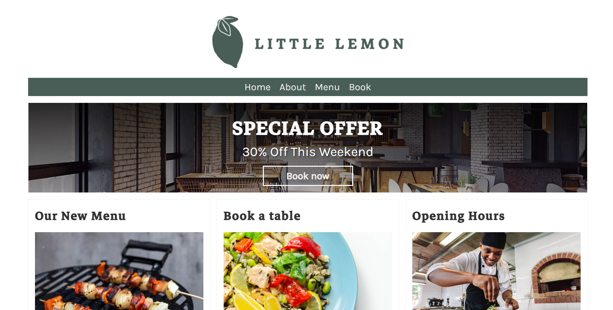

# Little Lemon Restaurant Website 🍋


A modern, responsive restaurant website built with Django for Little Lemon restaurant. This web application allows customers to browse the menu, view prices, and get information about the restaurant.

## 🚀 Features

- **Menu Display**: Browse through categorized menu items with detailed descriptions
- **Price Listing**: View current prices for all menu items
- **Responsive Design**: Optimized for desktop, tablet, and mobile devices
- **Restaurant Information**: About us, contact details, and location
- **Admin Panel**: Easy content management for restaurant staff
- **Search Functionality**: Find specific dishes quickly
- **Category Filtering**: Filter menu items by categories (appetizers, mains, desserts, etc.)

## 🛠️ Technology Stack

- **Backend**: Django 4.x
- **Frontend**: HTML5, CSS3, JavaScript)
- **Styling**: Bootstrap 5 / Custom CSS


## 📋 Prerequisites

Before running this project, make sure you have the following installed:

- Python 3.8 or higher
- pip (Python package installer)
- Git

## ⚡ Quick Start

### 1. Clone the Repository
```bash
git clone https://github.com/yourusername/little-lemon-restaurant.git
cd little-lemon-restaurant
```

### 2. Create Virtual Environment
```bash
# Create virtual environment
python -m venv littlelemon_env

# Activate virtual environment
# On Windows:
littlelemon_env\Scripts\activate

# On macOS/Linux:
source littlelemon_env/bin/activate
```

### 3. Install Dependencies
```bash
pip install -r requirements.txt
```

### 4. Database Setup
```bash
# Run migrations
python manage.py makemigrations
python manage.py migrate

# Create superuser (optional)
python manage.py createsuperuser
```

### 5. Load Sample Data (Optional)
```bash
python manage.py loaddata sample_data.json
```

### 6. Run the Development Server
```bash
python manage.py runserver
```

Visit `http://127.0.0.1:8000/` in your browser to view the website.

## 📁 Project Structure

```
little-lemon-restaurant/
├── littlelemon/                 # Main project directory
│   ├── __init__.py
│   ├── settings.py             # Django settings
│   ├── urls.py                 # Main URL configuration
│   └── wsgi.py
├── restaurant/                 # Main app directory
│   ├── models.py              # Database models
│   ├── views.py               # View functions
│   ├── urls.py                # App URL patterns
│   ├── admin.py               # Admin configuration
│   └── templates/             # HTML templates
│       └── restaurant/
│           ├── base.html
│           ├── menu.html
│           ├── home.html
│           └── about.html
├── static/                    # Static files
│   ├── css/
│   ├── js/
│   └── images/
├── media/                     # User uploaded files
├── requirements.txt           # Python dependencies
├── manage.py                 # Django management script
└── README.md
```

## 🎨 Key Pages

- **Home Page** (`/`): Welcome page with restaurant highlights
- **Menu Page** (`/menu/`): Complete menu with categories and prices
- **About Page** (`/about/`): Restaurant information and story
- **Contact Page** (`/contact/`): Contact details and location

## 🔧 Configuration

### Environment Variables
Create a `.env` file in the project root:

```env
SECRET_KEY=your-secret-key-here
DEBUG=True
DATABASE_URL=sqlite:///db.sqlite3
ALLOWED_HOSTS=localhost,127.0.0.1
```

### Database Models

**Menu Item Model:**
- Name
- Description  
- Price
- Category
- Image
- Availability status

**Category Model:**
- Name
- Description
- Display order

---
**Made with ❤️ and Django**

